# Library Management System wAIfu

## 📖 Mô tả
Dự án **Library Management System wAIfu** là một hệ thống quản lý thư viện, giúp quản lý sách, người dùng, và các giao dịch mượn trả sách, hỗ trợ AI tâm sự, phân tích văn.

## 📝 Nhóm tác giả:
1. **Trưởng nhóm**: Dương Quang Minh - 24022401
2. **Thành viên**: Lê Thanh Lâm - 24022377
3. **Thành viên**: Nguyễn Tân Hoàng Minh - 24022407

## Tính năng

### Login mutil-user: Admin | User
- **Tìm kiếm sách**: Tìm kiếm sách theo từ khóa.
- **Chi tiết sách**: Xem thông tin chi tiết về sách đã chọn, bao gồm:
    - Tiêu đề.
    - Tác giả(s).
    - Mô tả.
    - Bìa sách.
- **Mượn sách**: Mượn sách theo id hoặc name hoặc mượn nhanh bằng button.
- **Trả sách**: Trả sách theo id hoặc name hoặc trả nhanh bằng button.
- **AI**: Tâm sự và bàn luận về các cuốn sách.

### **Quản lý thư viện <Admin>**
- Thêm sách vào thư viện bằng scan.
- Xóa sách khỏi thư viện.
- Quản lí người dùng.
- Quản lí sách.

### **Giao diện người dùng tương tác**:
- Xây dựng bằng JavaFX và FXML cho giao diện người dùng dễ sử dụng.

## Công nghệ sử dụng

- **Java**: Logic cốt lõi và tích hợp API.
- **JavaFX**: Phát triển giao diện người dùng và xử lý sự kiện.
- **CSS**: Tùy chỉnh giao diện của các thành phần JavaFX.
- **Google Books API**: Dùng để lấy dữ liệu sách.
- **OPEN CV + Zxing**: Dùng Scan mã vạch lấy ISBN.
- **OPENAI API model gpt-4o**: Trợ lí ảo thủ thư viện.
- **FXML**: Tách biệt giao diện người dùng khỏi mã Java.

## Thiết kế hệ thống và Cơ sở dữ liệu của dự án

**Thiết kế hệ thống**  
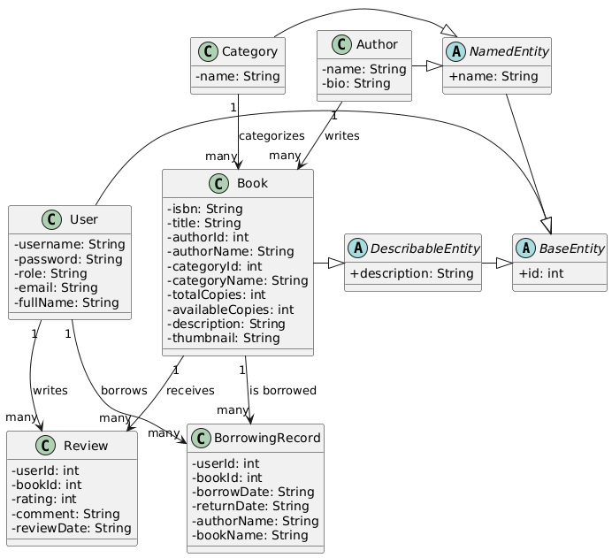

**Cơ sở dữ liệu**  
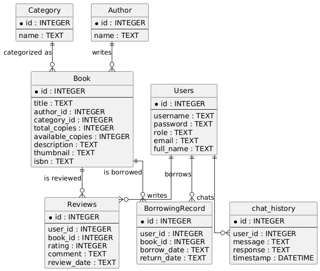

## Giới thiệu về ứng dụng

### **ĐĂNG NHẬP**: Đăng nhập và đăng ký
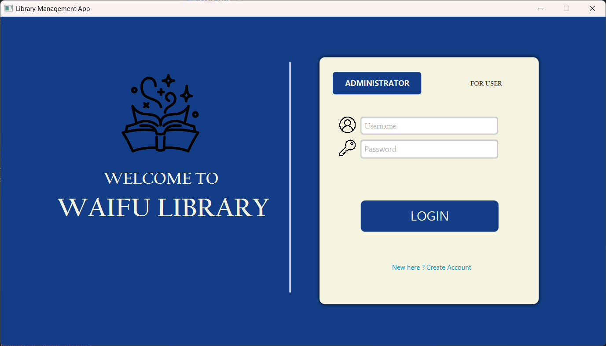
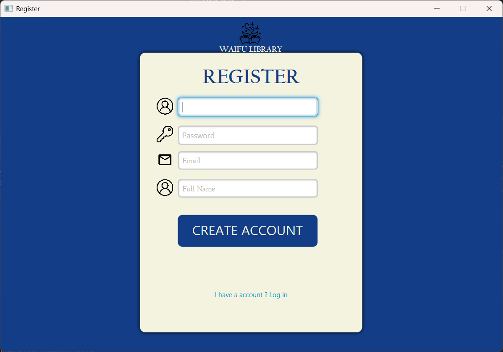

### **DashBoard**: Tổng quan về ứng dụng
- Ngăn sách mới thêm vào, Kệ sách của thư viện.
  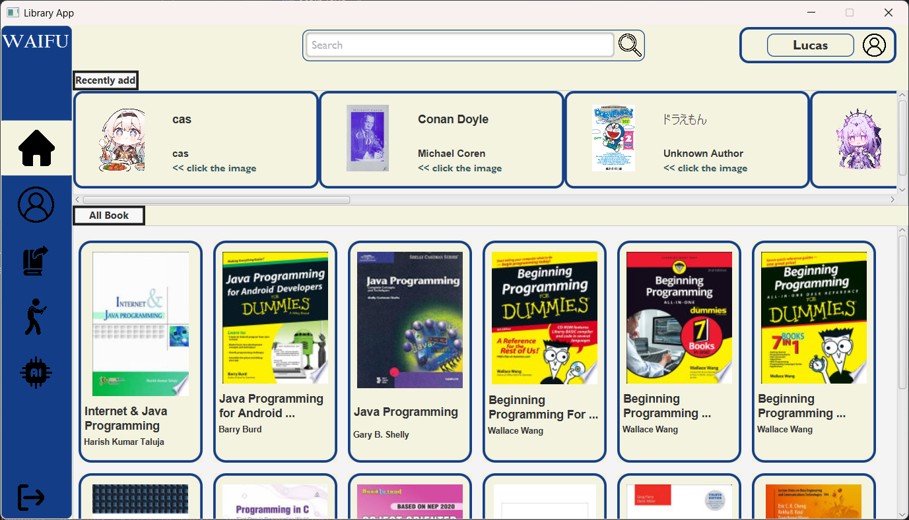
- Tra cứu bằng searchBar
   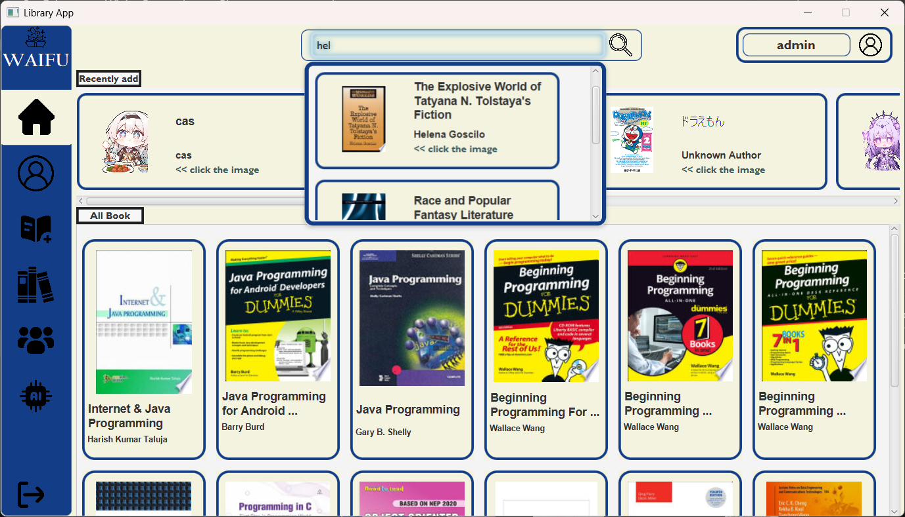
- Hiển thị kết quả tìm kiếm phân loại theo tên sách, ID, Tác giả.
  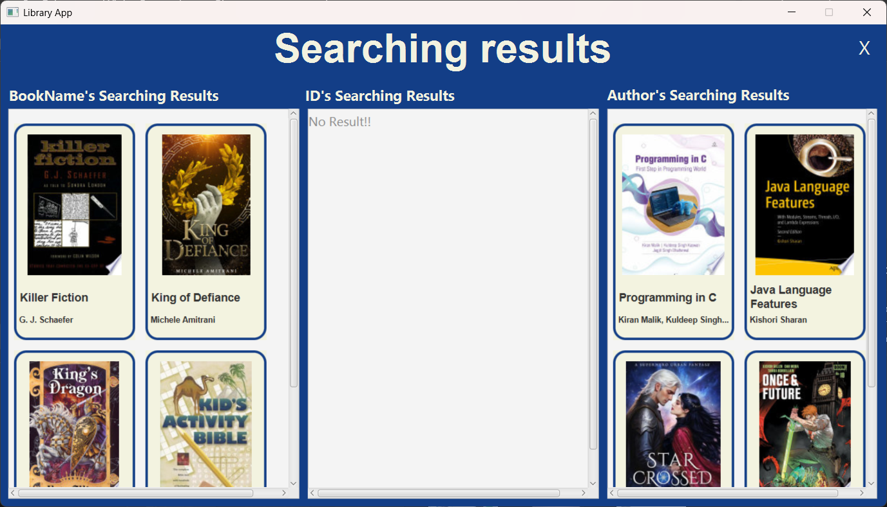

### **SÁCH**: thêm sách mới vào thư viện, và xem trước sách
- Quản lý sách đã thêm vào thư viện:  
  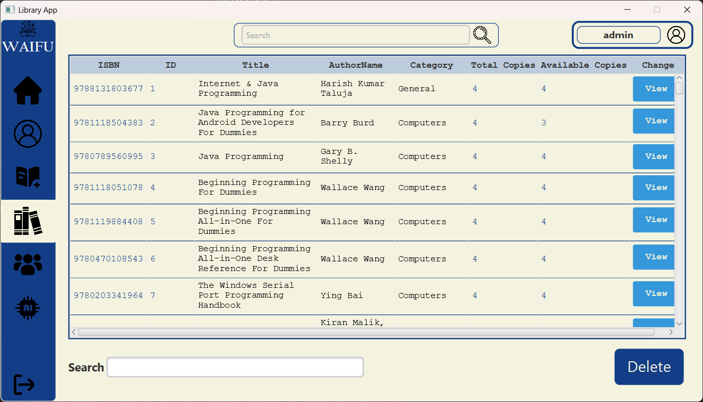
-Chỉnh sửa thông tin sách đã thêm vào thư viện.
  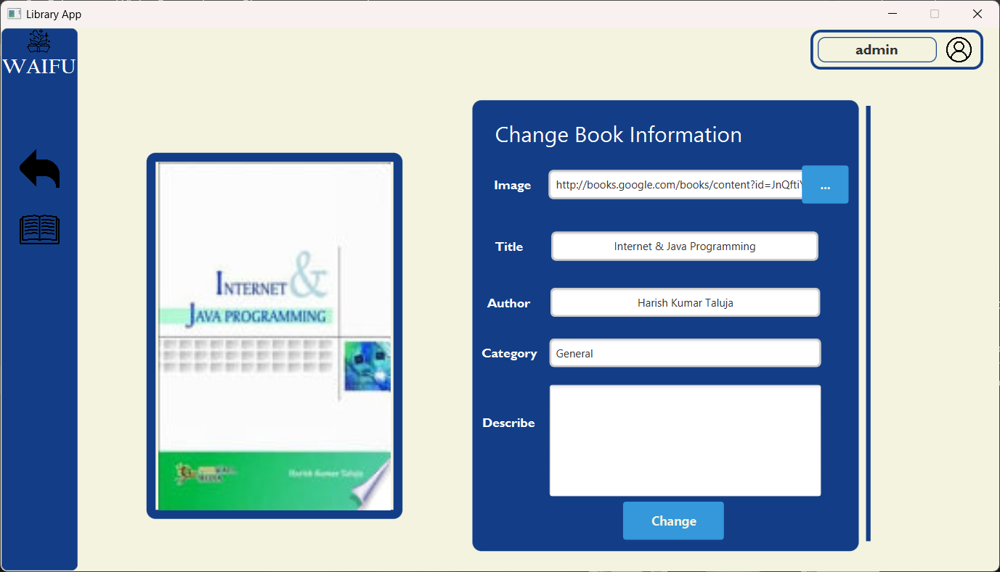
- Thêm sách vào thư viện thông qua name,ID hoặc scan.
  
- Xem trước sách, và mượn nhanh qua button Borrow:  
  

### **THÀNH VIÊN**: Xem thông tin thành viên, số lượng sách đã mượn, chỉnh sửa thành viên
-Hiển thị danh sách sách đã mượn.
 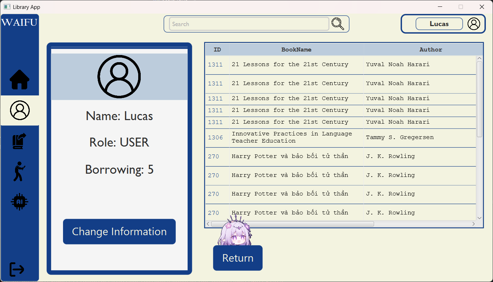
- Danh sách thành viên, thêm,xóa và chỉnh sửa thành viên.
  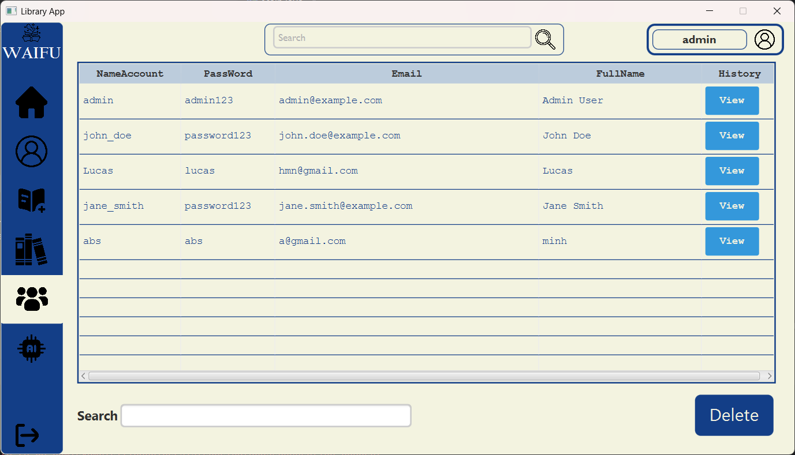
- Chỉnh sửa thông tin user.
  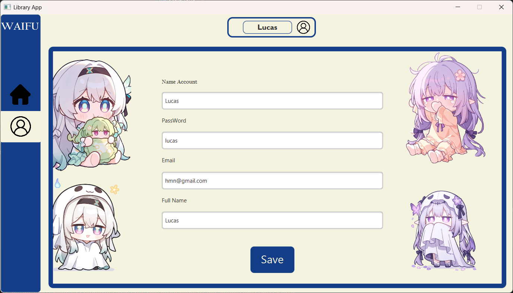

### **MƯỢN và TRẢ SÁCH**: Thông qua Name hoặc scan.  
  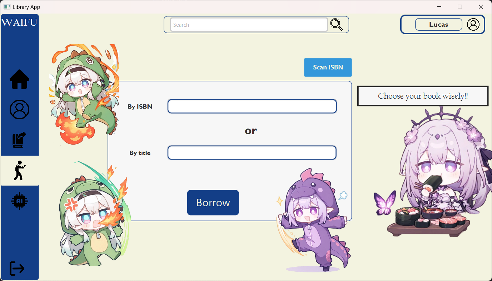

  
  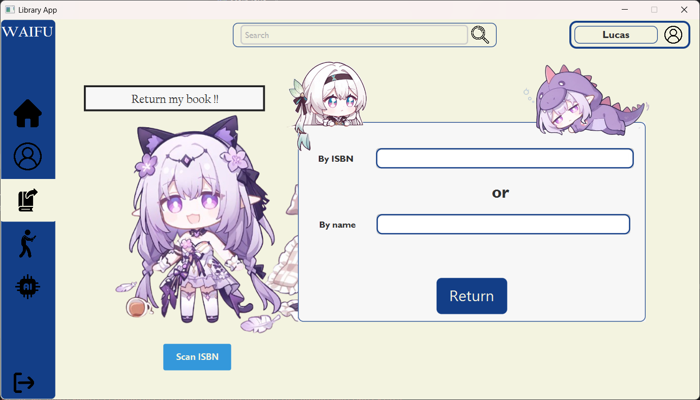

### ****: Thông qua Name hoặc scan.  
  

  
  

### ****: Bé Thủ thư AI đáng yêu lắng nghe những thắc mắc tâm tư tình cảm của bạn. Nhưng đừng tỏ tình ẻm sẽ từ chối bạn.  
  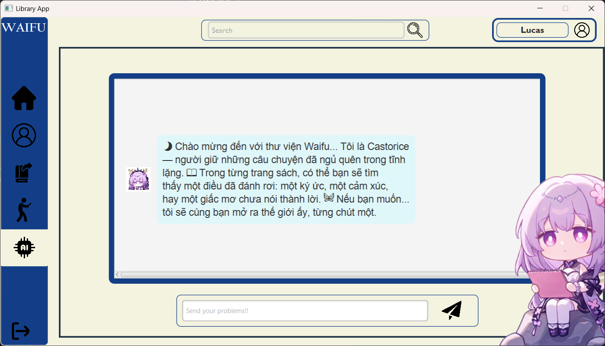


## Cài đặt

### Yêu cầu:
- Java 8+
- JavaFX 8+ (nếu không được tích hợp trong JDK của bạn)

### Các bước cài đặt:

```bash
# Clone dự án
git clone https://github.com/username/BTL-OOP-wAIfu.git

# Di chuyển vào thư mục dự án
cd BTL-OOP-wAIfU

# Cài đặt các dependencies (nếu có)
# Đảm bảo rằng JavaFX được cấu hình đúng trong IDE của bạn
# Yêu cầu với scan book:Tạo VM option"Link hướng dẫn ="https://drive.google.com/file/d/1MjGbADu2TV6_5MTC0u4CHGjI2yxbBgT8/view?fbclid=IwZXh0bgNhZW0CMTEAAR7jY6kXp3Qjc7r3ULnCaw8hT_GUnn0npdP5kn9c4lZu0qx14FWIPq_NVIkDYQ_aem_oRKUgJKBGxMHZdkMOGe8Ww" + paste"-Djava.library.path=D:/BTL-OOP-wAIfu/lib-app/native"

# Chạy dự án
# Trong IDE của bạn, chạy lớp `Main.java` để khởi động ứng dụng
